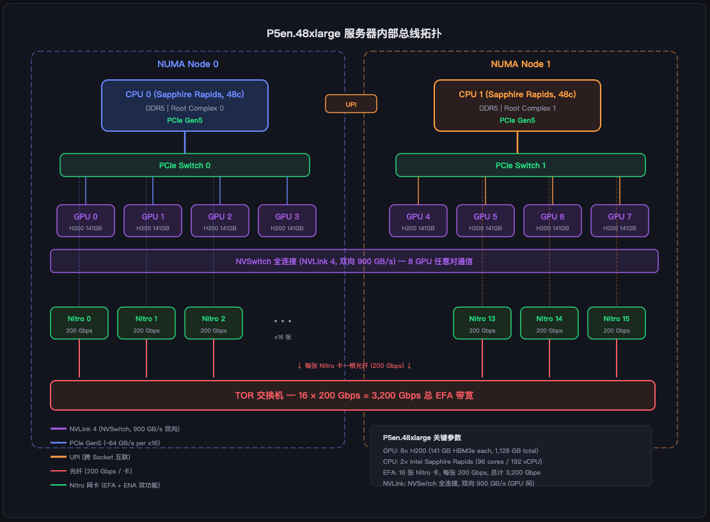
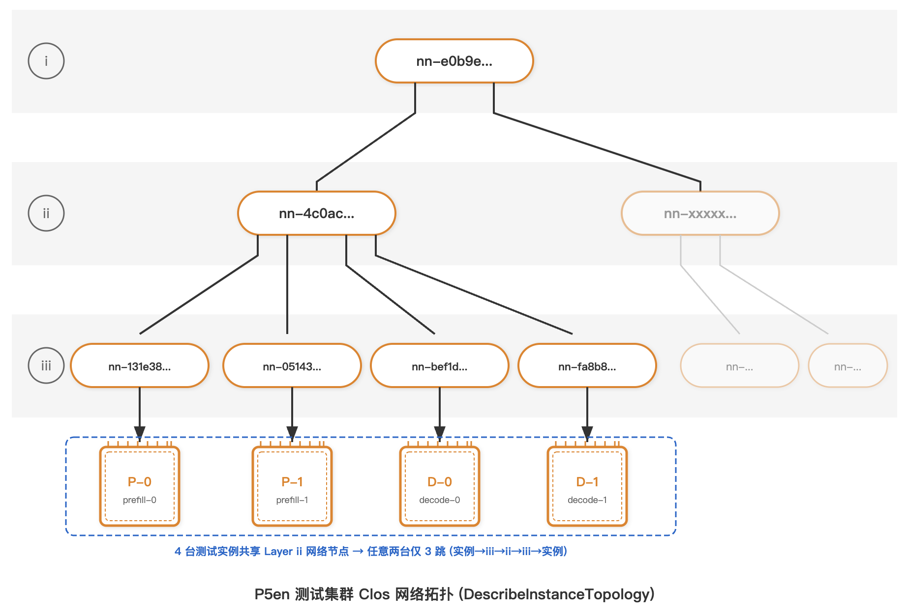
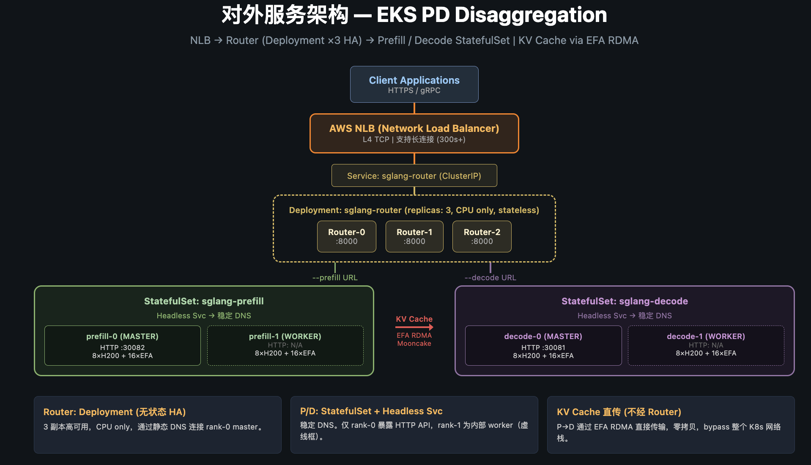
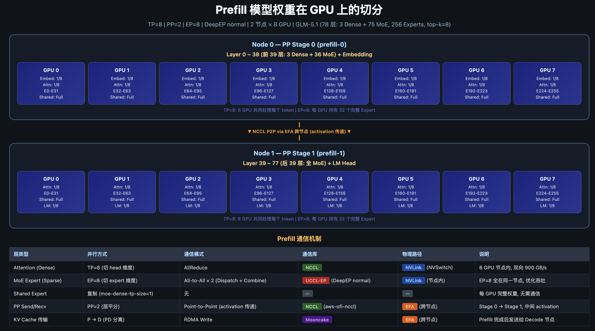
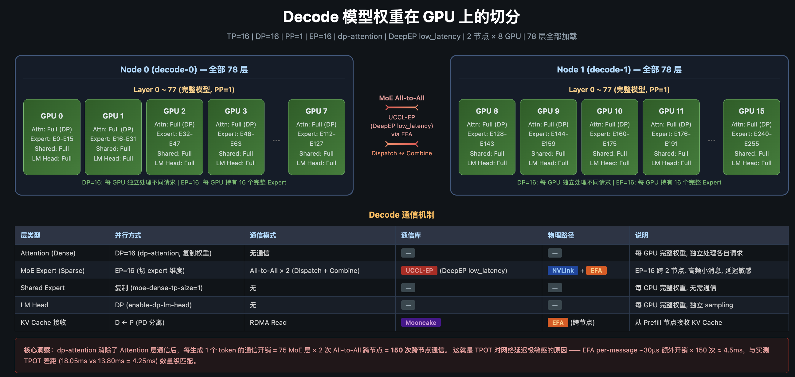
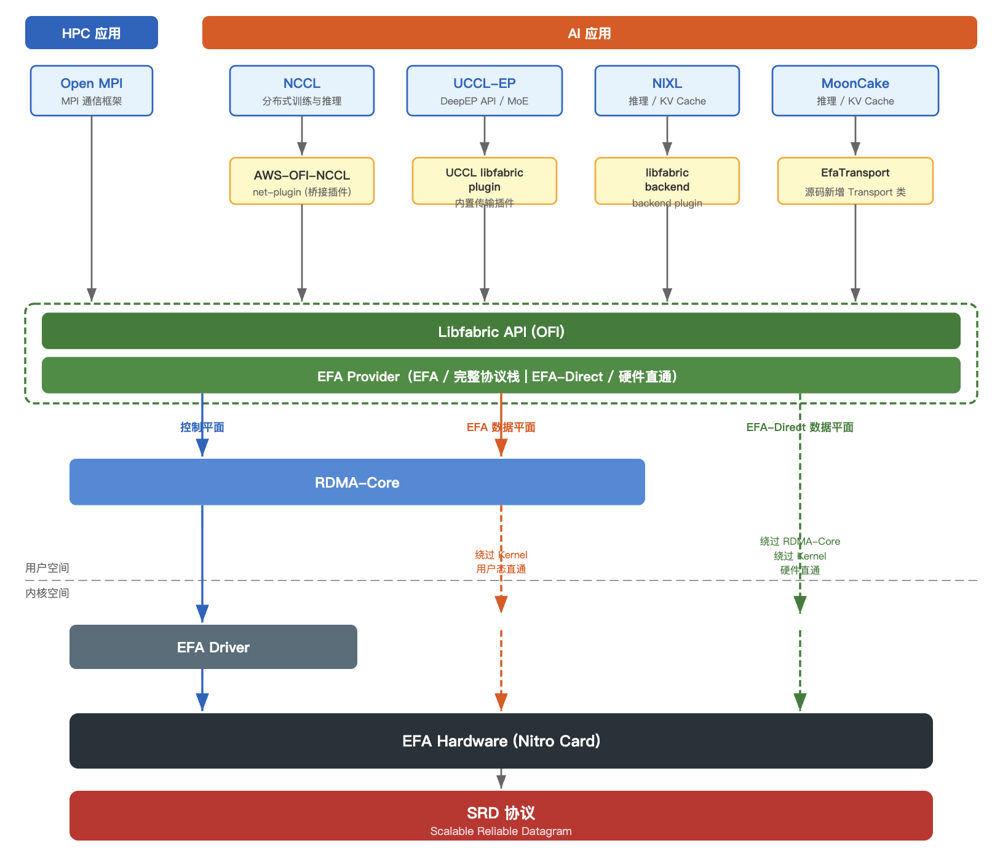
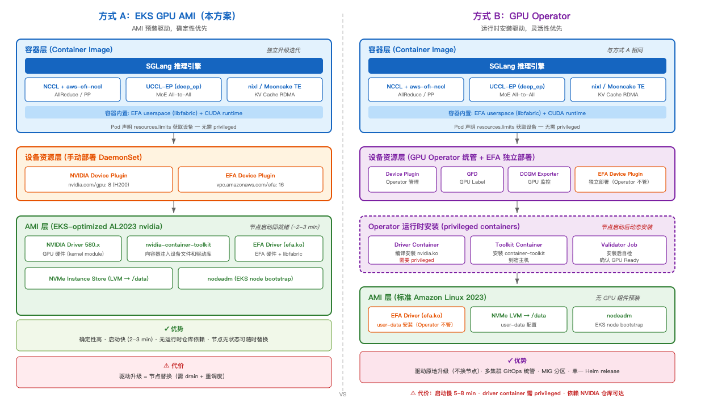

# 671B MoE 模型从自建 RoCE 集群迁移至 AWS EFA：Prefill-Decode 分离推理的通信架构验证

> 在 AWS P5en (H200 + EFA) 上部署 GLM-5.1 2P2D 分离推理，与客户自建 RoCE 集群进行端到端性能对比。

## 1. 背景与动机

### 1.1 客户现状

客户在自建机房使用基于 ConnectX 系列网卡的 RoCE 集群运行 GLM-5.1-FP8（671B MoE）模型推理服务，采用 Prefill-Decode (PD) 分离架构：2 台 Prefill 节点 + 2 台 Decode 节点，每台 8×H200 GPU。

**网络方案对比：**

| 　　　　　　 | 客户自建机房　　　　　　　　　　| AWS 云上　　　　　　　　　　　　 |
| --------------| ---------------------------------| ----------------------------------|
| **NIC 硬件** | ConnectX 系列 (NVIDIA/Mellanox) | EFA (AWS Nitro 自研网卡)　　　　 |
| **协议**　　 | RoCE v2 (RDMA over Ethernet)　　| SRD (Scalable Reliable Datagram) |

业务诉求：利用 AWS 弹性算力扩展本地 GPU 计算资源，同时获得更快的硬件迭代能力，从而降低硬件采购和折旧风险。

### 1.2 迁移挑战

这不是一个简单的"换个环境跑起来"的迁移。PD 分离架构对跨节点网络（EFA）的要求远超传统推理：

- **传统单机推理**：所有 GPU 通信走 NVLink，不涉及跨节点网络
- **2P2D 分离推理**：跨节点通信成为关键路径——PP 激活传递、MoE All-to-All dispatch/combine、KV Cache RDMA 写入，三种不同特性的流量同时考验 EFA

核心问题：**AWS EFA 能否在这种极端复杂的通信负载下，达到 ConnectX 系列 + RoCE 方案的性能水平？**

### 1.3 验证策略

我们基于客户的实际部署需求来验证：
- 推理框架：[SGLang](https://github.com/sgl-project/sglang)（UC Berkeley / LMSYS 开发，原生支持 PD 分离，集成 DeepEP、EAGLE 等关键组件，客户生产环境同样使用）
- 模型：GLM-5.1-FP8，671B 参数，256 Expert MoE，top-k=8
- 输入：120K tokens（长文本，Prefill 和 KV Cache 传输压力最大）
- 架构：2P2D（4 台 P5en.48xlarge，每台 8×H200 + 16×EFA）
- 对比基准：客户生产环境的实际性能数据

## 2. 物理网络环境

PD 分离推理的性能高度依赖跨节点通信延迟。在讨论通信架构之前，需要先理解底层的物理网络条件：单台实例内部的总线拓扑决定了节点内通信能力，实例间的网络位置决定了跨节点通信的物理距离，而容量获取方式决定了能否保证理想的网络拓扑。

### 2.1 节点内硬件拓扑

要评估 EFA 能否替代 RoCE，首先需要了解 P5en.48xlarge 内部的硬件互联结构——它决定了哪些通信走高速 NVLink，哪些必须经过 EFA 出节点。

每台 P5en.48xlarge 配备：
- 8× NVIDIA H200 GPU（NVSwitch 全连接，节点内双向 900 GB/s）
- 16× Nitro 网卡（每张 200 Gbps，总带宽 3200 Gbps）
- 双路 Intel Sapphire Rapids（96 核 / 192 vCPU）



**GPU 间通信路径：**

| 场景　　　　　 | 物理路径　　　　　　　　　　　　　　　　　　　　　　　 | 带宽　　　　　　　　　　　　　　　 |
| ----------------| --------------------------------------------------------| ------------------------------------|
| 同节点 GPU↔GPU | NVSwitch 直连（全连接拓扑，任意对）　　　　　　　　　　| 双向 900 GB/s　　　　　　　　　　　|
| 跨节点 GPU↔GPU | GPU → PCIe → Nitro NIC → TOR → 对端 Nitro → PCIe → GPU | 16×200 Gbps = 3,200 Gbps（总出口） |

同节点内 8 张 GPU 通过 NVSwitch 实现全连接，任意两张 GPU 之间无需经过 CPU 或 PCIe，延迟最低。跨节点通信则必须经过 PCIe 总线到 Nitro 网卡，走 EFA SRD 协议穿越 TOR 交换机到达对端节点。

### 2.2 节点间网络拓扑

跨节点通信性能不仅取决于单台实例的 EFA 带宽，还取决于多台实例之间的物理网络距离。如果 4 台 P5en 被分配到不同机架甚至不同网段，跨节点延迟会显著增加。我们需要验证测试集群的实际拓扑。

AWS 提供 [`DescribeInstanceTopology`](https://docs.aws.amazon.com/AWSEC2/latest/UserGuide/how-ec2-instance-topology-works.html) API 返回每台实例的 NetworkNodes 列表，自上而下地总览网络层次结构，底层节点会连接到实例。

> 判断实例间物理距离的规则：从底层（数组最后一个元素）开始向上比较，两台实例共享的最底层网络节点越深，物理距离越近。——[AWS 官方文档](https://docs.aws.amazon.com/AWSEC2/latest/UserGuide/how-ec2-instance-topology-works.html)

本次测试集群（eu-south-2a）4 台 P5en.48xlarge 的拓扑数据：

| 节点名称　| IP            | Layer i (顶层)　　 | Layer ii (中间)　　 | Layer iii (底层，直连实例) |
| -----------| ---------------| --------------------| ---------------------| ----------------------------|
| prefill-0 | 6.166.xxx.245 | nn-e0b9exxxbdd8d80 | nn-4c0acxxx606bbca1 | nn-131e3xxx6df4f93　　　　 |
| prefill-1 | 6.166.xxx.226 | nn-e0b9exxxbdd8d80 | nn-4c0acxxx606bbca1 | nn-05143xxx952561b76　　　 |
| decode-0　| 6.166.xxx.15  | nn-e0b9exxxbdd8d80 | nn-4c0acxxx606bbca1 | nn-bef1dxxx8007f1c3　　　　|
| decode-1　| 6.166.xxx.241 | nn-e0b9exxxbdd8d80 | nn-4c0acxxx606bbca1 | nn-fa8b8xxx166b592e　　　　|

根据如上的拓扑数据我们可以得到如下清晰的网络拓扑结构：



**拓扑解读：**

- **Layer iii（底层）**：每台实例各不相同——多台 P5en.48xlarge 很难被分配到同一个底层网络节点
- **Layer ii（nn-4c0ac...）**：4 台实例全部相同——共享同一个中间层网络节点，跨节点通信路径为 实例→Layer iii→Layer ii→Layer iii→实例，仅 3 跳
- **Layer i（nn-e0b9e...）**：4 台实例全部相同——同属一个顶层域

这是 4 台 P5en 能获得的**最优拓扑配置**：虽然底层节点各异（大实例无法共享底层节点），但共享 Layer ii 意味着 P↔D 的 KV Cache RDMA 传输和 Decode 跨节点 MoE All-to-All 通信均走最短路径，不会上升到 Layer i 产生额外跳数。

### 2.3 如何在申请时获得最优拓扑

2.2 节验证了测试集群的实际拓扑是最优的，但这个结果是如何保证的？在生产环境中，我们不能依赖运气来获得好的拓扑配置。AWS 提供了 Cluster Placement Group (CPG) 和两种容量预留机制来解决这个问题。

#### Cluster Placement Group (CPG)

AWS 通过 [Cluster Placement Group](https://docs.aws.amazon.com/AWSEC2/latest/UserGuide/placement-strategies.html#placement-groups-cluster) 提供拓扑保证：

> "Instances in the same cluster placement group enjoy a higher per-flow throughput limit for TCP/IP traffic and are placed in the same **high-bisection bandwidth segment** of the network."
> — [AWS Documentation](https://docs.aws.amazon.com/AWSEC2/latest/UserGuide/placement-strategies.html#placement-groups-cluster)

CPG 保证同组实例放置在同一高二分带宽网段内。但需注意：CPG **不保证同一机架**（文档明确说 "Instances are not isolated to a single rack"）。结合 2.2 节的拓扑数据，CPG 的保证本质上对应"共享 Layer ii 网络节点"。

#### GPU 实例的两种容量获取方式

GPU 实例资源紧张，裸启动经常遇到 InsufficientCapacity。生产环境通常通过以下两种方式锁定容量：

| | On-Demand Capacity Reservation (ODCR) | Capacity Block for ML |
|---|---|---|
| **本质** | 立即生效的容量预留，持续占用直到取消 | 按时间段预约的 GPU 专属容量（最远 8 周后） |
| **计费** | 创建即开始按 On-Demand 价格计费（不论是否跑实例） | 仅在预约时间段内计费，提前锁定价格 |
| **取消** | 随时可取消 | 不可取消 |
| **适用场景** | 长期稳定需求、需要灵活扩缩容 | 短期 ML 任务（训练、测试），按天/周预约 |

#### 两种容量获取方式与拓扑保证

| | ODCR | Capacity Block |
|---|---|---|
| **能否指定 CPG** | **能**。创建时通过 `--placement-group-arn` 指定 | **不能**。API 全程无 placement group 参数 |
| **拓扑保证机制** | 用户主动指定 CPG → 保证 high-bisection bandwidth segment | AWS 自动从 [UltraCluster](https://aws.amazon.com/ec2/ultraclusters/) 容量池分配，隐含物理邻近 |
| **容量不足时** | `create-capacity-reservation` 返回 InsufficientCapacity 错误 | `describe-capacity-block-offerings` 返回空列表（无可用 offering） |
| **保证强度** | 明确（CPG 有 API 级别的网段保证） | 隐含（"placed close together inside UltraClusters"，无量化承诺） |

**本次测试使用的是 Capacity Block**，4 台 P5en 被分配到同一 Layer ii 网络节点下，验证了 Capacity Block 的实际放置效果满足 2P2D 分离推理的通信需求。

在实际使用时，如果申请数量较多，难以同时满足数量和 CPG 拓扑约束，则可以先获取容量，再通过 `DescribeInstanceTopology` API 查询各实例的网络位置，对有跨节点通信需求的工作负载选择距离更近（共享更底层网络节点）的实例进行模型部署。

## 3. PD 分离架构与模型切分

### 3.1 为什么需要 Prefill-Decode 分离

大语言模型处理一次请求分为两个阶段：**Prefill（预填充）** 阶段一次性读入用户输入的所有 token，理解上下文；**Decode（解码）** 阶段逐个生成回答的 token，直到结束。这两个阶段对 GPU 的使用方式截然不同：

- **Prefill 是计算密集型**。

  一次处理成千上万个 token（GLM-5.1 支持 200K context），GPU 的算力被充分利用。类比：一次性读完一整道题，然后集中思考。因此衡量 Prefill 效率使用 **TTFT（Time To First Token）**——从收到请求到输出第一个 token 的耗时，反映模型"理解输入"的速度。

- **Decode 是访存密集型**。

  每次只生成 1 个 token，却需要加载整个模型的权重做一次完整 forward。GPU 大部分时间在等数据从显存搬到计算单元，算力严重空转。类比：一字一字写答案，每写一个字都要翻一遍全部笔记。因此衡量 Decode 效率使用 **TPOT（Time Per Output Token）**——生成每个 token 的平均耗时，反映模型"输出回答"的速度。

对于小模型，两个阶段可以在同一组 GPU 上分时复用。但 GLM-5.1 是 671B 参数的 MoE 模型（256 个 Expert，每 token 激活 top-8），模型规模和稀疏激活特性使得两个阶段的**最优 GPU 组织方式从根本上互相矛盾**：

* **Prefill 的逻辑：吞吐优先，通信留在节点内。**

  Prefill 一次处理数千甚至数万个 token，GPU 算力充分饱和，瓶颈在吞吐而非延迟。因此核心目标是**尽量避免跨节点通信**——跨节点走 EFA 的带宽和延迟远不如节点内 NVLink。

  具体做法：Attention 层和 MoE Expert 层都限制在单节点 8 张 GPU 内完成（Attention 切 8 份做 AllReduce，256 个 Expert 分配在 8 张 GPU 上各持有 32 个），所有通信走 NVLink（900 GB/s）。模型太大一个节点装不下怎么办？通过 Pipeline Parallel（PP=2）做层间切分——两个节点各负责一半层数，节点间只需传递每个 micro-batch 的中间激活值，通信量小且频率低。

* **Decode 的逻辑是一条因果链：**

  每次只生成 1 个 token → 单请求计算量极小，GPU 算力严重浪费 → 必须让每张卡同时服务多个请求 → 每卡要独立处理请求就必须持有完整权重 → 显存紧张 → Expert 分散到更多 GPU。具体展开：

1. Decode 每次只生成 1 个 token，单个请求的计算量极小，如果一张 GPU 只服务一个请求，算力严重空转。解决方法：**数据并行**——让每张 GPU 同时处理多个不同请求的 Decode，提高利用率。
2. 要让每张 GPU 独立处理请求，它就必须持有完整的 Attention 权重（不能像 Prefill 那样切成 8 份，否则每生成一个 token 都要跨卡 AllReduce 同步）。这是"用显存换通信"的 trade-off：复制权重 → 消除 Attention 层的跨卡通信。
3. 完整 Attention 权重多占了显存。为了在 141 GB 显存中同时装下完整 Attention 权重和 MoE Expert，需要把 256 个 Expert 分散到更多 GPU 上——从 8 张扩展到 16 张（跨 2 个节点），每 GPU 只持有 16 个 Expert。
4. Expert 分散到 16 张 GPU 后，MoE 的 All-to-All 通信不可避免地跨节点了。但 Decode 每次只路由 1 个 token 的数据，单次传输量小，可以用针对小消息优化的低延迟通信模式来缓解。

两套策略完全矛盾：Prefill 要 Expert 集中在节点内避免跨节点通信；Decode 要 Expert 分散到多节点来腾出显存给 Attention 复制。如果强行共享同一组 GPU，就必须折中——结果是 Prefill 跑不满算力，Decode 通信延迟又压不下来，两边都不是最优状态。

PD 分离的思路是：**给每个阶段各自分配独立的 GPU 集群，用各自的最优配置运行**。Prefill 集群压榨计算吞吐，Decode 集群压缩单 token 延迟。两者之间通过网络传递 KV Cache（Prefill 的输出结果）来衔接。代价是多了一次 KV Cache 跨节点传输，但对于 671B MoE 这个量级的模型，独立优化带来的收益远超传输开销。

下面的表格总结了两个阶段的核心差异：

| 特征 | Prefill（预填充） | Decode（解码） |
|------|-------------------|---------------|
| 计算模式 | 大批量 token 并行计算 | 逐 token 自回归生成 |
| GPU 利用率 | 高（计算密集） | 低（访存密集） |
| 延迟敏感度 | 中（用户等待首 token） | 极高（用户感知每 token 间隔） |
| 最优 GPU 组织 | 少量 GPU 各持有多 Expert，通信留在节点内 | 多 GPU 各持有少 Expert，复制 Attention 权重消除通信 |
| 瓶颈 | 算力 | 显存带宽 + 网络延迟 |

### 3.2 整体部署架构与请求流转

PD 分离部署后，Prefill 和 Decode 各自是独立的推理进程，对外暴露不同端口。用户请求需要一个统一入口来协调两者——这就是 **Router** 的作用。Router 是 SGLang 提供的轻量路由组件（纯 CPU，不持有模型），负责：

1. 接收用户请求，转发给 Prefill 集群处理输入
2. 协调 KV Cache 从 Prefill 传输到 Decode（通过 bootstrap port）
3. 将 Decode 生成的 token 流式返回给用户

下图展示了在 EKS 上的完整部署架构：



**生产 HA 设计：** Router 本身无状态，可以部署多副本（如图中 3 副本 Deployment），前端挂 NLB 实现高可用。Prefill 和 Decode 使用 StatefulSet 部署，通过 Headless Service 提供稳定 DNS（`prefill-0`, `prefill-1`...），支持多组副本水平扩展。**本次实验为简化验证，仅部署单组 Prefill（2 节点）和单组 Decode（2 节点）**，未做多副本 HA。

**Router 启动参数：**

```bash
python3 -m sglang_router.launch_router \
  --pd-disaggregation \
  --mini-lb \
  --prefill "http://sglang-prefill-0:30082" 5555 \
  --decode "http://sglang-decode-0:30081" \
  --host 0.0.0.0 \
  --port 8000
```

`--pd-disaggregation` 启用 PD 分离模式，`--mini-lb` 使用轻量负载均衡策略。`5555` 是 Prefill 的 bootstrap port，用于 Prefill 和 Decode 之间协商 KV Cache RDMA 传输地址。

**性能测试命令：**

```bash
python3 -m sglang.bench_serving \
  --backend sglang-oai \
  --base-url http://<router-endpoint>:8000 \
  --dataset-name random \
  --random-input-len 120000 \
  --random-output-len 1000 \
  --num-prompts 1024 \
  --request-rate 0.4
```

测试使用 120K input + 1K output 的长文本场景，1024 个请求以 0.4 req/s 的恒定速率发送。在该速率下实际并发约 10~30 个请求，Prefill 和 Decode 均处于持续满载状态。

**一次 120K 请求的完整流转：**

1. **Router 接收请求** → 转发给 Prefill 集群
2. **Prefill 处理**（PP=2, TP=8, EP=8）：2 节点协作，节点内 NVLink 完成 Attention AllReduce 和 MoE All-to-All，节点间仅 PP 传递中间激活值
3. **KV Cache 传输**：Prefill 生成的 KV Cache 通过 Mooncake Transfer Engine / nixl（底层走 libfabric → EFA RDMA）直接写入 Decode 节点的显存，bypass 整个 K8s 网络栈
4. **Decode 生成**（DP=16, EP=16）：每张 GPU 独立处理 Attention（dp-attention），MoE 层通过跨节点 All-to-All 路由 token 到 Expert，逐 token 生成回答
5. **流式返回** → 用户感知到每个 token 的输出

下面分别展开 Prefill 和 Decode 各自的切分配置。

### 3.3 实验中的 Prefill 切分方式与解读

本次实验使用的 Prefill 启动参数如下：

```bash
python3 -m sglang.launch_server \
  --model-path /data/models/GLM-5.1-FP8 \
  --disaggregation-mode prefill \
  --disaggregation-transfer-backend mooncake \
  --tp-size 8 \
  --pp-size 2 \
  --dp-size 1 \
  --nnodes 2 \
  --chunked-prefill-size 16384 \
  --context-length 202752 \
  --attention-backend nsa \
  --enable-nsa-prefill-context-parallel \
  --nsa-prefill-cp-mode round-robin-split \
  --deepep-mode normal \
  --moe-a2a-backend deepep \
  --moe-dense-tp-size 1 \
  --ep-dispatch-algorithm dynamic \
  --eplb-algorithm deepseek \
  --mem-fraction-static 0.85 \
  --max-running-requests 128
```

关键参数说明：

| 参数 | 值 | 含义 |
|------|---|------|
| `--tp-size 8` | 8 | Attention 切 head 维度，每 GPU 持有 64/8 = 8 个 attention head |
| `--pp-size 2` | 2 | 78 层平分，Stage 0 持有 Layer 0-38，Stage 1 持有 Layer 39-77 |
| `--dp-size 1` | 1 | 不做数据并行，所有 GPU 协作处理同一批请求 |
| `--moe-dense-tp-size 1` | 1 | Shared Expert 不切分，每 GPU 完整复制 |
| `--deepep-mode normal` | normal | DeepEP 吞吐优先模式（大 batch、高带宽利用） |
| `--chunked-prefill-size 16384` | 16384 | 长序列按 16K token 分块处理，控制显存峰值 |
| `--disaggregation-transfer-backend mooncake` | mooncake | 使用 Mooncake Transfer Engine 做 KV Cache 跨节点 RDMA 传输 |
| `--attention-backend nsa` | nsa | Native Sparse Attention（模型架构决定） |

对应的模型切分如下图所示（PP=2, TP=8, EP=8, 2 节点 × 8 GPU）：



**一个 120K 请求在 Prefill 内部的处理过程：**

120K token 的输入不会一次性全部计算，而是按 `chunked-prefill-size=16384` 切分为约 8 个 chunk（每 chunk 16K token），逐 chunk 送入 Pipeline。以一个 chunk 在单个 Stage 内的处理流程为例：

1. **Attention 层（Dense，TP=8）**

   16K token 的 hidden state 在 8 张 GPU 上各自做部分计算（每 GPU 负责 1/8 的 attention 计算）。计算完成后做一次 **AllReduce**（NVLink，节点内），让每张 GPU 都拥有完整的 Attention 输出。

2. **MoE 层（Sparse，EP=8）**

   AllReduce 之后，每张 GPU 都持有全部 16K token 的完整 hidden state。进入 MoE 前，16K token 在逻辑上均分到 8 张 GPU——每卡"认领"其中 2K 个 token 作为自己的 routing 责任（数据本身已在本地，无需搬运）：

   - 每卡对自己认领的 2K token 计算 Router Gate → 每个 token 选出 top-8 Expert ID
   - **All-to-All Dispatch**：每卡根据路由结果，将 token 的 hidden state 发送到对应 Expert 所在的 GPU。由于每 token 路由到 8 个 Expert，每卡实际发出 2K × 8 = 16K 份 token 数据，分散到 8 张 GPU。注意接收端不是均分的——哪个 GPU 的 Expert 被选中更多，就收到更多 token（这也是 DeepEP `normal` 模式需要先统计 recv 数量再动态分配 buffer 的原因）
   - 每张 GPU 上的 32 个 Expert 对收到的 token 执行 FFN 计算
   - **All-to-All Combine**：计算结果返回给原始发送端的 GPU，加权求和

   整个 All-to-All 过程全部在节点内 8 张 GPU 之间完成（NVLink），不出节点。

   > **通信模式对比：** AllReduce 是集合通信——8 张卡通过 Ring 或 Tree 算法协同传输，每卡发送量对称、目标固定。All-to-All Dispatch 是点对点路由——每卡根据路由结果向不同 GPU 发送不等量数据，通信模式非对称，无法用 Ring 算法优化。这也是 MoE 通信需要专门的 DeepEP 库而不能直接用 NCCL 的原因。

3. **Shared Expert（复制，无通信）**

   每张 GPU 各自对自己负责的 token 独立计算 Shared Expert FFN，结果与 MoE 输出相加。

4. **PP 跨节点传递**

   一个 chunk 经过 Stage 0 的 39 层（每层重复上述 Attention + MoE 计算）后，生成的中间激活值通过 **NCCL send/recv**（aws-ofi-nccl → EFA）跨节点发送到 Stage 1 的对应 GPU。

5. **Pipeline 并行**

   关键优势：120K 输入的所有 token 一开始就全部已知。Stage 0 处理完 chunk 1 发给 Stage 1 后，**立刻开始处理 chunk 2**——两个 Stage 几乎完全重叠工作，Pipeline 利用率接近 100%。

   ```
   时间 →
                 chunk 1        chunk 2        chunk 3        chunk 4
   Stage 0:     [████████████]  [████████████]  [████████████]  [████████████]
                      ↓               ↓               ↓               ↓
   Stage 1:          [████████████]  [████████████]  [████████████]  [████████████]
   ```

**通信总结：** Prefill 的所有高频通信（Attention AllReduce + MoE All-to-All）都在节点内完成（NVLink）。唯一的跨节点通信是 PP 层间激活传递——每个 chunk 仅一次 send/recv，数据量为一个中间层的 hidden state（16K token × 6144 hidden_dim × 2 Bytes ≈ 200 MB），频率低、对延迟不敏感。

> 注：虽然模型权重使用 FP8 量化（1 Byte），但计算过程中的中间激活值（activation）保持 BF16 精度（2 Bytes），避免量化误差在层间累积。因此 PP 传递的数据按 BF16 计算大小。

### 3.4 实验中的 Decode 切分方式与解读

本次实验使用的 Decode 启动参数如下：

```bash
python3 -m sglang.launch_server \
  --model-path /data/models/GLM-5.1-FP8 \
  --disaggregation-mode decode \
  --disaggregation-transfer-backend mooncake \
  --tp-size 16 \
  --dp-size 16 \
  --nnodes 2 \
  --enable-dp-attention \
  --enable-dp-lm-head \
  --moe-dense-tp-size 1 \
  --deepep-mode low_latency \
  --moe-a2a-backend deepep \
  --ep-dispatch-algorithm dynamic \
  --eplb-algorithm deepseek \
  --context-length 202752 \
  --attention-backend nsa \
  --mem-fraction-static 0.74 \
  --max-running-requests 256 \
  --cuda-graph-max-bs 16 \
  --speculative-algorithm EAGLE \
  --speculative-num-steps 3 \
  --speculative-eagle-topk 1 \
  --speculative-num-draft-tokens 4
```

关键参数说明：
| 参数　　　　　　　　　　　　　　| 值　　　　　| 含义　　　　　　　　　　　　　　　　　　　　　　　　　　　　　 |
| ---------------------------------| -------------| ----------------------------------------------------------------|
| `--tp-size 16`　　　　　　　　　| 16　　　　　| EP=TP=16，256 Expert 分布在 16 张 GPU 上，每 GPU 持有 16 个　　|
| `--dp-size 16`　　　　　　　　　| 16　　　　　| 16 路数据并行，每 GPU 独立处理不同请求的 Decode　　　　　　　　|
| `--enable-dp-attention`　　　　 | —　　　　　 | Attention 层走数据并行（每卡完整权重，消除 AllReduce）　　　　 |
| `--enable-dp-lm-head`　　　　　 | —　　　　　 | LM Head 层也走数据并行，避免跨卡通信　　　　　　　　　　　　　 |
| `--deepep-mode low_latency`　　 | low_latency | DeepEP 低延迟模式（小 batch、延迟敏感）　　　　　　　　　　　　|
| `--mem-fraction-static 0.74`　　| 0.74　　　　| 比 Prefill (0.85) 低——需要为完整 Attention 权重留出显存　　　　|
| `--speculative-algorithm EAGLE` | EAGLE　　　 | 投机解码：3 步 draft + 1 步 verify（4 次 forward/cycle）　　　 |
| `--cuda-graph-max-bs 16`　　　　| 16　　　　　| CUDA Graph 最大 batch size，减少 kernel launch 开销　　　　　　|
| `--max-running-requests 256`　　| 256　　　　 | 集群同时在飞的请求总数上限（16 GPU × 每卡 batch 约 16 个请求） |

对应的模型切分如下图所示（TP=16, DP=16, EP=16, PP=1, 2 节点 × 8 GPU）：



**Decode 阶段的逐 token 生成过程：**

与 Prefill 一次性处理完整输入不同，Decode 每次只生成 1 个 token，然后将其追加到上下文中，再生成下一个 token。集群通过 `dp-size=16` + continuous batching 同时处理多个请求——`max-running-requests=256` 意味着 16 张 GPU 各自同时处理约 16 个不同请求的 Decode。

以一个 token 的生成过程为例（每张 GPU 上约 16 个请求并行）：

1. **Attention 层（dp-attention，无通信）**

   每张 GPU 持有完整的 Attention 权重（`--enable-dp-attention`），独立处理自己负责的那批请求的 Attention 计算。16 张 GPU 之间**完全不需要通信**——这是与 Prefill 最大的区别。Prefill 的 TP=8 需要 AllReduce 汇总结果，而 Decode 的 dp-attention 彻底消除了这一开销。

   代价：每张 GPU 必须存储完整 Attention 权重（不切分）。

2. **MoE 层（Sparse，EP=16 跨节点）**

   256 个 Expert 分布在 2 节点 × 8 GPU = 16 张卡上，每 GPU 持有 16 个 Expert。这是 Decode 通信复杂度的核心来源：

   - 每张 GPU 对自己当前 batch（约 16 个请求的当前 token）计算 Router Gate → 每个 token 选出 top-8 Expert ID
   - **All-to-All Dispatch**：每卡根据路由结果，将 token 的 hidden state 发送到对应 Expert 所在的 GPU。256 个 Expert 均匀分布在 2 节点 × 8 GPU 上，每个 token 路由到 8 个 Expert——目标 Expert 在同节点则走 NVLink，在另一节点则走 EFA。统计上约一半的 Expert 在对端节点，因此**每次 All-to-All 都必然包含跨节点 EFA 通信**（不像 Prefill 的 EP=8 可以全部在 NVLink 内完成）
   - 16 张 GPU 上的 Expert 对收到的 token 执行 FFN 计算
   - **All-to-All Combine**：计算结果沿原路返回——同节点走 NVLink，跨节点走 EFA

   **关键差异——频率与路径：** 模型有 75 层 MoE，每层 2 次 All-to-All（Dispatch + Combine），因此每生成一个 token 就要 **75 × 2 = 150 次跨节点通信**。虽然每次通信的数据量很小（每 GPU 只有约 8-16 个 token 的 hidden state），但 150 次/token 的频率意味着对**单次通信延迟**极为敏感。这就是为什么 Decode 使用 `--deepep-mode low_latency` 而非 Prefill 的 `normal` 模式。

3. **DeepEP Low-Latency 模式**

   Prefill 的 `normal` 模式每卡处理 2K token，路由到 256 个 Expert 后分布不确定，必须先通信统计每张 GPU 实际会收到多少 token → CPU 介入为接收端分配对应大小的显存 buffer → 再执行实际数据传输。这套流程对 Prefill 没问题（大 batch 对延迟容忍度高），但 Decode 每卡只有约 8 个 token，每个 token 要经历 150 次 All-to-All，每次都等 CPU 介入是不可接受的。

   `low_latency` 模式的核心思路：Decode 的 token 数量极少，接收端 buffer 的上限是可预知的——即使最极端情况下所有 GPU 的 token 全部路由到同一张卡，也不过 16 卡 × 8 token = 128 个 token 的数据量。因此可以跳过"统计→分配"的步骤，直接按最坏情况预分配固定 buffer。这带来三个好处：
   - **无 CPU 同步**：单个 CUDA kernel 完成整个 Dispatch/Combine，不需要 CPU 介入
   - **兼容 CUDA Graph**（`--cuda-graph-max-bs 16`）：无 CPU 中断意味着整个 forward 的数百个 kernel 可以被 capture 并一次 replay，消除逐个 launch 的开销
   - **预分配固定 buffer**（`SGLANG_DEEPEP_NUM_MAX_DISPATCH_TOKENS_PER_RANK=128`，即每卡接收 buffer 最多容纳 128 个 token）：用约 1 GB 显存换掉每次通信的动态统计延迟

4. **Shared Expert + LM Head（无通信）**

   每张 GPU 独立计算 Shared Expert FFN 和 LM Head（`--enable-dp-lm-head`），输出下一个 token 的概率分布。整个过程不产生跨卡通信。

5. **EAGLE 投机解码**

   为进一步降低 TPOT，Decode 启用 EAGLE 投机解码（`--speculative-algorithm EAGLE`）：每个 cycle 先用轻量 draft model 猜测 3 个 token（`--speculative-num-steps 3`），再用主模型一次 forward 验证。命中时 1 个 cycle 可输出最多 4 个 token，将有效 TPOT 降低到原来的 1/2~1/4。

6. **无 Pipeline Parallel（PP=1）**

   Decode 不使用 PP——78 层全部在 16 张 GPU 上完成，没有跨节点的层间传递。原因：token 生成严格顺序依赖（第 N+1 个 token 依赖第 N 个的输出），Stage 0 必须等 Stage 1 完成才能开始下一个 token——没有独立的 chunk 可以填充 Pipeline，利用率最多 50%，全是气泡。

**通信总结：** Decode 的唯一高频通信是 MoE All-to-All——每个 output token 触发 150 次跨节点 EFA 通信。单次数据量小（每 GPU 约 16 token × 6144 dim × 2 Bytes ≈ 200 KB），但对延迟极度敏感。与 Prefill 形成鲜明对比：Prefill 的 All-to-All 走 NVLink（节点内），Decode 的 All-to-All 走 EFA（跨节点）。这正是本次 EFA 迁移中最具挑战的场景——IB RoCE 的 IBGDA 可在网卡侧完成 All-to-All 调度，而 EFA 需要 UCCL 在软件层模拟类似行为。

## 4. 推理过程中的通信分解

PD 分离架构下，Prefill 和 Decode 的通信模式截然不同。下面按层类型分别列出两个阶段的通信机制。

### 4.1 Prefill 通信机制

| 层类型 | 并行方式 | 通信模式 | 通信库 | 物理路径 | 说明 |
|--------|---------|---------|--------|---------|------|
| Attention (Dense) | TP=8 (切 head 维度) | AllReduce | NCCL | NVLink (NVSwitch) | 8 GPU 节点内，双向 900 GB/s |
| MoE Expert (Sparse) | EP=8 (切 expert 维度) | All-to-All × 2 (Dispatch + Combine) | UCCL-EP (DeepEP normal) | NVLink (节点内) | EP=8 全在同一节点，优化吞吐 |
| Shared Expert | 复制 (moe-dense-tp-size=1) | 无 | — | — | 每 GPU 完整权重，无需通信 |
| PP Send/Recv | PP=2 (层平分) | Point-to-Point (activation 传递) | NCCL (aws-ofi-nccl) | EFA (跨节点) | Stage 0 → Stage 1，中间 activation |
| KV Cache 传输 | P → D (PD 分离) | RDMA Write | Mooncake TE / nixl | EFA (跨节点) | Prefill 完成后发送给 Decode 节点 |

### 4.2 Decode 通信机制

| 层类型 | 并行方式 | 通信模式 | 通信库 | 物理路径 | 说明 |
|--------|---------|---------|--------|---------|------|
| Attention (Dense) | DP=16 (dp-attention，复制权重) | **无通信** | — | — | 每 GPU 完整权重，独立处理各自请求 |
| MoE Expert (Sparse) | EP=16 (切 expert 维度) | All-to-All × 2 (Dispatch + Combine) | UCCL-EP (DeepEP low_latency) | NVLink + EFA | EP=16 跨 2 节点，高频小消息，延迟敏感 |
| Shared Expert | 复制 (moe-dense-tp-size=1) | 无 | — | — | 每 GPU 完整权重，无需通信 |
| LM Head | DP (enable-dp-lm-head) | 无 | — | — | 每 GPU 完整权重，独立 sampling |
| KV Cache 接收 | D ← P (PD 分离) | RDMA Read | Mooncake TE / nixl | EFA (跨节点) | 从 Prefill 节点接收 KV Cache |

### 4.3 关键挑战

对比两张表可以看出：Prefill 的高频通信（Attention AllReduce + MoE All-to-All）全部走 NVLink，EFA 只承担低频的 PP 传递和一次性的 KV Cache 写入。而 Decode 的 dp-attention 消除了 Attention 通信后，**唯一的高频通信就是 MoE All-to-All——每生成 1 个 token 需要 75 层 × 2 次 = 150 次跨节点通信**。每次通信的消息很小（~7KB/expert/token），但对延迟极其敏感——这正是 ConnectX 系列 (IBGDA) 和 EFA 架构差异最显著的场景。


### 4.4 通信软件栈：各库的来源与适配关系

PD 分离推理涉及多个通信库协同工作，它们由不同团队开发，通过不同方式适配到 EFA 上：

| 通信库 | 开发者 | 定位 | 仓库 |
|--------|--------|------|------|
| **NCCL** | NVIDIA | GPU 集合通信标准库（AllReduce、Send/Recv） | github.com/NVIDIA/nccl |
| **aws-ofi-nccl** | AWS | NCCL → libfabric 的 API 翻译插件 | github.com/aws/aws-ofi-nccl |
| **DeepEP** | DeepSeek（深度求索） | MoE Expert Parallelism 专用 All-to-All 通信库 | github.com/deepseek-ai/DeepEP |
| **UCCL-EP** | UC Berkeley / UC Davis，AWS 参与 | DeepEP 的跨平台适配层——保留 DeepEP API，替换底层传输（支持 EFA、IB、Broadcom） | github.com/uccl-project/uccl |
| **Mooncake** | 月之暗面（Moonshot AI / Kimi） | PD 分离的 KV Cache 跨节点传输引擎 | github.com/kvcache-ai/Mooncake |
| **NIXL** | NVIDIA（Dynamo 项目） | 单边 RDMA KV Cache 传输抽象层 | github.com/ai-dynamo/nixl |
| **libfabric** | 开源社区（Intel 主导，OFIWG） | 跨厂商网络传输抽象库 | github.com/ofiwg/libfabric |

所有通信库最终都通过 **libfabric** 访问 EFA，但各自到 libfabric 的适配方式不同——NCCL 和 NIXL 有标准 plugin 接口，UCCL-EP 内置 libfabric 传输插件，Mooncake 则需要直接修改源码新增 Transport 类。

下图展示了完整的 EFA 通信软件栈分层，从上层应用到底层 SRD 协议的调用路径：



## 5. 性能实测：AWS EFA vs 客户自建 RoCE 集群

前面几章介绍了 PD 分离架构的通信需求和 EFA 软件栈的工作方式。本章直接给出端到端性能对比结果——在相同模型、相同架构、相同负载下，AWS EFA 与客户自建 ConnectX 系列 RoCE 集群的实际表现差异。

### 5.1 测试配置

| 参数 | 值 |
|------|-----|
| 模型 | GLM-5.1-FP8 (78 层, 256 Expert, top-k=8, 671B) |
| 输入长度 | 120,000 tokens |
| 输出长度 | 1,000 tokens |
| 请求数 | 128 |
| Request Rate | AWS: 0.36 req/s / 客户: 0.4 req/s（对齐 TTFT） |
| 部署架构 | 2P2D (2 Prefill + 2 Decode, 各 2 节点 × 8 H200 GPU) |
| KV Cache 传输 | Mooncake Transfer Engine over EFA |
| MoE 通信 | UCCL-EP (DeepEP) |

### 5.2 核心指标对比

> 以下所有延迟指标均为**越低越好**。

| 指标 | 客户 RoCE (ConnectX 系列) | AWS P5en EFA | 比较 | 分析 |
|------|-------------|-------------|------|------|
| Mean TTFT | 11,904 ms | 12,977 ms | AWS 高 9% | Prefill 计算密集，网络非瓶颈 |
| **Mean TPOT** | **13.80 ms** | **18.05 ms** | **AWS 高 31%** | MoE 150 次小消息累积 |
| Mean ITL | 42.75 ms | 54.92 ms | AWS 高 28% | 与 TPOT 趋势一致 |
| P99 ITL | 56.20 ms | 66.98 ms | AWS 高 19% | 尾部差距收窄 |
| **Max ITL** | **434.30 ms** | **116.99 ms** | **AWS 低 73%** | **SRD 多路径优势** |
| Mean E2E | 25,686 ms | 31,006 ms | AWS 高 21% | TPOT 差距 × token 数累积 |

### 5.3 差距根因分析

**TTFT 差距仅 9% — Prefill 不受 per-message 延迟影响：**
- Prefill 的 MoE All-to-All 走 NVLink（EP=8 全在节点内），不走 EFA
- 唯一走 EFA 的是 PP Send/Recv（仅在 Pipeline Stage 边界跨节点传输，每 token 仅 1 次）
- 9% 差距主要来自 PP 跨节点传输和 request rate 对齐调整（AWS 0.36 vs 客户 0.4 req/s）

**TPOT 差距 31% — Decode 的 Achilles' heel：**
- Decode EP=16 跨 2 节点，每层 MoE 需 2 次跨节点 All-to-All
- 75 MoE 层 × 2 次/层 = 150 次，每次多 ~28μs → 累积 4.25ms 差距
- 这不是带宽问题（3200 Gbps 绰绰有余），纯粹是 per-message latency

**Max ITL 低 73% — EFA 的结构性优势：**
- RoCE 单路径遇到拥塞时无法绕行，产生 434ms 极端毛刺
- EFA SRD 将每个数据包 spray 到多条路径，天然负载均衡
- 结果：极端尾延迟 AWS 比 RoCE 好 3.7 倍


## 6. EFA 与 ConnectX 系列：两种高性能网络的设计哲学

上一章的数据显示，EFA 在跨节点 MoE 通信密集的 Decode 阶段 TPOT 高出 31%，但极端尾延迟反而好 3.7 倍。为了深入理解这一性能差距的根因，我们回到两种网络的设计原点——它们从诞生之初就在解决根本不同的问题。

### 6.1 为什么 AWS 自研 EFA

ConnectX 系列网卡（无论 InfiniBand 还是 RoCE 模式）是 GPU 集群高性能互联的事实标准，为何 AWS 不直接采购，而是从 Nitro 硬件到 SRD 协议全部自研？AWS 在其 [HPC 技术博客](https://aws.amazon.com/blogs/hpc/in-the-search-for-performance-theres-more-than-one-way-to-build-a-network/)中明确阐述了原因——传统 RDMA 方案（IB 和 RoCE）的架构假设与云规模运营存在根本性冲突：

**问题 1：高性能 RDMA 需要"特殊网络"，与云弹性冲突。** IB 需要专用交换机和布线；RoCE 虽然跑在以太网上，但要达到高性能也需要对交换机做大量特殊配置——PFC 无损流控、ECN 标记、专用 VLAN、大 MTU——实质上把一部分交换机变成了不能与其他流量共用的"准无损专用 Fabric"。无论哪种，这些特殊配置的网段都是事实上的"计算孤岛"。而 AWS 已拥有覆盖全球的超大规模以太网基础设施，**在统一 Fabric 上自研 SRD 协议比维护一套独立的 RDMA 专用网络更经济、更可控**。EFA 与普通 VPC 流量共享同一物理网络，GPU 实例的弹性扩缩容无需改变网络拓扑或交换机配置。

**问题 2：7×24 运营与运维脆弱性。** IB 的 Subnet Manager 要求拓扑变更时全局重新计算路由，即便国家级超算也需定期停机做 Fabric 重构；RoCE 的 PFC 在大规模下极易产生死锁和拥塞扩散，一个配置错误就可能瘫痪整个网段。AWS 不能接受：客户 7×24 依赖服务运行。SRD 运行在**标准有损以太网**上，无需 Subnet Manager 或 PFC，通过 Nitro 硬件实现拥塞控制和丢包恢复，响应速度比软件快几个数量级——网络拓扑变更和链路故障对应用完全透明。

**问题 3：尾延迟，而非平均延迟。** IB 和 RoCE 都强制 per-QP 严格有序交付——一个丢包会阻塞该 QP 上后续所有包（队头阻塞）。在多租户共享网络中，偶发拥塞导致 P99 尾延迟灾难性恶化。SRD 的核心创新是**放弃有序交付，将数据包同时 spray 到数十条路径**，任何单条路径的拥塞都不影响其他包。结果：P99 尾延迟改善约 10 倍——而 HPC/AI 应用的实际性能恰恰由尾延迟决定，不是微基准的单包延迟。

**问题 4：弹性扩展。** IB/RoCE 的面向连接模型（每对进程一个 QP），万节点时需管理上亿 QP——内存和建连开销极为庞大。SRD 无连接 1:N 模型，单端点可与任何对端通信，已验证扩展至 20,000+ 节点。

> **参考文献：** Shalev L, Ayoub H, Bshara N, Sabbag E. "A Cloud-Optimized Transport Protocol for Elastic and Scalable HPC." IEEE Micro, vol.40, no.6, pp.67-73, Nov-Dec 2020.

一句话总结：**传统 RDMA 方案（IB/RoCE）为固定拓扑的专用集群设计，EFA/SRD 为持续增长的共享云基础设施设计**——不是谁更"好"的问题，而是解决根本不同的约束。

### 6.2 EFA 代系演进

EFA 的 RDMA 能力（带宽、延迟、RDMA 语义）取决于底层 Nitro Card 版本。自 2018 年首次发布至今已演进五代：

| 代际 | 年份 | Nitro Card | 延迟 | 带宽/卡 | RDMA 语义 | 代表实例 |
|------|------|-----------|------|---------|----------|----------|
| EFA v1 | 2018 | Nitro v3 | 14 μs | 100 Gbps | Send/Receive（不支持 RDMA 写）| P3dn, P4d |
| EFA v2 | 2020 | Nitro v4 | 9.3 μs | 170 Gbps | 有限 RDMA 写支持 | P5, P5e, TRN1 |
| EFA v3 | 2022 | Nitro v5 | 6.8 μs | 200 Gbps | 有限 RDMA 写支持 | P5en, Trn2 |
| EFA v4 | 2024 | Nitro v6 | 5.8 μs | 400 Gbps | 完整 RDMA 读/写支持 | P6-B200/B300, G7e |

> 本次测试使用 P5en（EFA v3, Nitro v5），单卡 200 Gbps × 16 卡 = 3,200 Gbps 总 EFA 带宽。

### 6.3 协议层对比：RoCE v2 vs EFA/SRD

两种方案在协议层的设计选择差异，直接决定了 MoE 推理场景中的性能特征：

| 维度 | RoCE v2 (ConnectX 系列) | EFA/SRD |
|------|------------------------|---------|
| **流类型** | 消息 (Message) | 消息 (Message) |
| **消息顺序** | 有序 (per QP) | 无序（应用层可实现有序）|
| **路由** | ECMP（依赖交换机支持，路径选择受限）| ECMP 随机负载均衡（多路径自动切换，动态统计 RTT 切换）|
| **拥塞控制** | ECN + DCQCN（依赖交换机支持，基于 PFC/ECN）| 动态速率 + HT 切换（无 PFC 依赖）|
| **可扩展性** | 中等（QPS 数量、PFC 配置复杂）| 高（QPS 数量与集群大小无关）|
| **是否需专用交换机** | 是（需支持 ECN + PFC，配置复杂）| 否（运行于 UDP/IP 之上，无交换机硬要求）|
| **部署复杂度** | 中高（MTU、流控、PFC 错误配置风险大）| 低（无状态、零配置依赖，易于大规模部署）|
| **可靠性模型** | 无内建链路层重传，依赖质量稳定或应用层重试 | 应用级管理（如 NCCL 内部 retry，EFA 支持）|

**核心设计哲学差异：** RoCE/InfiniBand 追求单次操作的极限低延迟（有状态 NIC + 确定性路由 + GPU 直驱），代价是部署复杂度高、扩展性受限；EFA/SRD 追求大规模稳定性（无状态 NIC + 多路径 spray + 硬件拥塞控制），代价是 per-message 延迟略高。

### 6.4 MoE 通信的核心挑战与 UCCL-EP 的解决方案

理解协议差异后，回到本次测试的核心问题：MoE All-to-All 通信在两种网络上的实际表现差异。

#### 问题定义

Decode 每生成一个 token，需要经过 75 层 MoE，每层执行一次 Dispatch（发送 token 到目标 Expert）+ 一次 Combine（接收 Expert 计算结果），共 **150 次跨节点小消息通信**。每条消息仅 ~7KB（hidden_dim × FP8），但对延迟极度敏感——任何 per-message 开销都被 150 次累积放大。

#### DeepEP 原始方案：IBGDA 直驱

DeepSeek 开源的 [DeepEP](https://github.com/deepseek-ai/DeepEP) 库为 InfiniBand 设计，采用 IBGDA（InfiniBand GPUDirect Async）机制——GPU kernel 内的 warp 线程直接写 ConnectX NIC 的 doorbell 寄存器触发 RDMA 传输，全程不经过 CPU：

```
GPU kernel warp → 写 NIC doorbell 寄存器 → NIC 立即 DMA → 网络传输
                  （零 CPU 参与，硬件闭环）
```

这依赖 NVIDIA 收购 Mellanox 后的垂直整合：ConnectX 网卡的 doorbell 寄存器通过 PCIe BAR 映射暴露给 GPU，其精确格式（位宽、字段布局）对 CUDA 开发者公开，使得 GPU kernel 中的 warp 线程可以直接按格式构造 Work Request 并写入 doorbell 触发 NIC 工作。这种 GPU 直驱 NIC 的能力是同一厂商（NVIDIA）同时控制 GPU 和 NIC 两端硬件的产物。

#### UCCL-EP 的跨平台适配：CPU Proxy 架构

EFA NIC（AWS 自研 Nitro 卡）不暴露 doorbell 给 GPU，IBGDA 无法使用。为了解决 DeepEP 无法在 EFA 上运行的问题，UC Berkeley / UC Davis 团队开发了 [UCCL-EP](https://github.com/uccl-project/uccl)（Mao Z, Zhang Y, et al. "UCCL-EP: Portable Expert-Parallel Communication." [arXiv:2512.19849](https://arxiv.org/abs/2512.19849), OSDI 2026），通过 CPU Proxy 架构实现跨平台适配：

```
GPU kernel warp → 写指令到 GPU 显存中的 FIFO 队列（含目标地址、长度等元数据）
                           ↓
CPU Proxy 线程 busy-poll 该 FIFO（通过 PCIe BAR 映射读取 GPU 显存）
                           ↓
解析指令 → 调用 libfabric API 提交发送请求（fi_send）
                           ↓
EFA NIC 通过 GPUDirect RDMA 直接从 GPU 显存 DMA 读取数据 → 网络传输
```

数据路径不经过 CPU 内存（NIC 直接 DMA GPU 显存），CPU 只负责转发控制指令。

**关键设计决策：**

| 决策 | 原因 |
|------|------|
| 保留 GPU 发起通信 | DeepEP 的 token-level 精细控制（去重、分块 reduce）必须在 GPU 端做 |
| CPU 代执行 RDMA | CPU 通过通用 libfabric 对接任何 NIC，实现跨平台可移植 |
| 数据仍走 GPUDirect | 7KB 数据不经 CPU 内存，NIC 直接 DMA GPU 显存，带宽不妥协 |

论文指出这一架构的核心价值在于**可移植性**：传统方式下，每种 GPU 与每种 NIC 的组合都需要单独开发通信内核（开发成本 O(m×n)）；UCCL-EP 将问题解耦为两层——GPU 侧只需实现一套 FIFO 写入接口（与 NIC 无关），CPU 侧通过标准 libfabric 对接任何网卡（与 GPU 无关）——开发成本降为 O(m+n)。实际验证：将 UCCL-EP 从 NVIDIA GPU + EFA 移植到 AMD MI300X + EFA 仅花 3 人月，而无需重写任何网络层代码。

#### 通信路径对比与延迟量化

| 步骤 | IBGDA (ConnectX) | UCCL-EP (EFA) | 差异来源 |
|------|-----------|---------------|---------|
| GPU 发起 | 写 NIC doorbell (~ns) | 写 FIFO (~ns) | ≈0 |
| 指令到达 NIC | 立即（同一 PCIe 总线） | CPU poll FIFO → 解析 → 提交发送 | **+3-10 μs** |
| 网络传输 | 交换机确定性转发 | SRD 多路径 spray | ≈相同 |
| 接收端处理 | NIC 硬件检查 → 写 CQE | CPU poll CQ → 重排序 → 通知 GPU | **+3-10 μs** |
| **每次通信总计** | **~5-15 μs** | **~20-40 μs** | **~15-25 μs** |

UCCL-EP 论文实测（EP=16, Low-Latency 模式, 128 tokens）：

| 操作 | UCCL-EP on EFA (P5en) | DeepEP on IB (MI300X+CX7) | 倍数 |
|------|----------------------|---------------------------|------|
| Dispatch | 226 μs | 136 μs | 1.66× |
| Combine | 293 μs | 207 μs | 1.42× |

用本次实测 TPOT 反推：

```
TPOT 差距: 18.05ms (EFA) - 13.80ms (IB) = 4.25ms
每 token 通信次数: 75 层 × 2 = 150 次
每次通信额外延迟: 4.25ms / 150 ≈ 28μs
```

~28μs 的 per-message 差距与路径分析完全吻合。这不是带宽问题——3,200 Gbps EFA 绰绰有余——纯粹是 CPU Proxy 中转的固定开销被高频小消息累积放大。

### 6.5 EFA 的结构性优势：尾延迟稳定性

EFA SRD 的 Packet Spray 多路径设计，在延迟的另一个维度上展现优势——per-message 略慢，但极端情况远好于单路径方案：

| 延迟指标 | RoCE (ConnectX 系列) | AWS EFA | 对比 |
|---------|---------|---------|------|
| Mean ITL | 42.75 ms | 54.92 ms | EFA 高 28% |
| P99 ITL | 56.20 ms | 66.98 ms | EFA 高 19% |
| **Max ITL** | **434.30 ms** | **116.99 ms** | **EFA 低 73%** |

RoCE 的确定性单路径路由在平均情况下更快，但一旦某条链路拥塞，该 QP 上所有流量被阻塞，产生极端尾部毛刺（434ms）。EFA 的 SRD 逐包分散到多条路径，天然避免单点阻塞，极端延迟仅 117ms。

**对生产环境的意义：** 用户感知的是"最慢的那个 token"。Max ITL 从 434ms 降到 117ms，用户体验的最差情况改善了 3.7 倍。对于在线服务的 SLA 保障，尾延迟稳定性往往比中位延迟更关键。

## 7. 部署架构与生产化

### 7.1 GPU 节点软件栈分层

MoE PD 分离推理对节点软件栈有三个核心要求：GPU 计算能力、高速网络设备（EFA）、以及将两者安全暴露给容器的机制。我们将节点软件栈分为三层，每层职责清晰：

**三层分工：**

| 层 | 核心职责 | 关键组件 |
|----|---------|---------|
| **容器层** | 封装应用软件栈，可独立于节点升级 | SGLang + NCCL/aws-ofi-nccl (AllReduce/PP) + UCCL-EP (MoE) + nixl/Mooncake TE (KV Cache) |
| **设备资源层** | 向 K8s 调度器注册非标准设备，安全分配给 Pod | NVIDIA Device Plugin (`nvidia.com/gpu: 8`) + EFA Device Plugin (`vpc.amazonaws.com/efa: 16`) |
| **AMI 层** | 让操作系统识别硬件，节点启动即就绪 | NVIDIA Driver 580.x + nvidia-container-toolkit + EFA Driver (efa.ko) + libfabric + NVMe LVM |

**为什么需要这样分层？** EFA 和 GPU 都是"非标准"设备——不能像 CPU/内存一样被容器运行时自动发现。AMI 层让操作系统识别硬件；Device Plugin 让 K8s 调度器感知资源数量并安全分配给 Pod；容器层封装应用软件栈，通过声明 `resources.limits` 获取设备访问，可独立于 AMI 和节点进行升级迭代。

### 7.2 GPU 软件栈部署方式：EKS GPU AMI vs GPU Operator

在 EKS 上部署 GPU 工作负载，有两种主流方式安装节点的 GPU/EFA 软件栈。核心区别：驱动和 toolkit 是在 AMI 构建时预装（确定性优先），还是通过 NVIDIA GPU Operator 在运行时动态安装（灵活性优先）。



**方式 A（EKS GPU AMI）** 将 NVIDIA 驱动、nvidia-container-toolkit、EFA 驱动全部预装在 AMI 中，节点启动 2-3 分钟即可接收 Pod。升级驱动时需要发布新 AMI → 滚动替换节点（drain + 新节点加入）。**方式 B（GPU Operator）** 使用标准 AL2023 AMI，GPU 驱动由 Operator 的特权容器在节点启动后编译安装（5-8 分钟就绪），升级驱动只需修改 ClusterPolicy 中的版本号，Operator 自动在节点上原地替换，无需换节点。

本方案选择方式 A：推理服务节点无状态（模型权重从 S3 拉取），节点替换成本低，AMI 的确定性和启动速度更重要。注意：无论哪种方式，EFA 相关组件（驱动 + Device Plugin）都需要独立于 GPU Operator 管理——Operator 是 NVIDIA 项目，不负责 AWS EFA 设备。

## 8. 结论与展望

### 8.1 核心结论

本次测试覆盖了 MoE PD 分离推理的全部通信模式——AllReduce（TP 并行）、PP Send/Recv（跨节点流水线）、MoE All-to-All（Expert Dispatch/Combine）、KV Cache RDMA 传输——全面验证了从 IB/RoCE 迁移到 AWS EFA 在复杂通信场景下的支持能力。涉及的通信库 NCCL（aws-ofi-nccl）、UCCL-EP、nixl/Mooncake TE 均已达到生产可用级别，所有通信路径正常工作。

| 维度 | 结论 |
|------|------|
| TTFT (首 token, PP=2) | 仅高 9%，Prefill 阶段以 TP AllReduce（NVLink 节点内）为主，EFA 仅承载 PP 跨节点通信，网络不是瓶颈 |
| TPOT (每 token, EP=16) | 高 31%，来自 MoE 跨节点 per-message 延迟累积（CPU Proxy 架构固有开销，非带宽问题） |
| 尾延迟稳定性 | Max ITL 低 73%（434ms → 117ms），EFA SRD 多路径 Packet Spray 的结构性优势 |

TPOT 31% 的差距来源清晰。随着 EFA 硬件代际演进和软件栈持续优化，这一差距有望进一步收窄。

---

*测试环境：AWS P5en.48xlarge × 4, eu-south-2a (Milan), SGLang 0.5.10, UCCL-EP + Mooncake, 2026 年 5 月*
